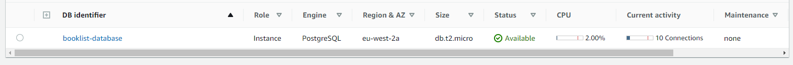

# Bonus

## Descrição

API simples de uma lista de livros.

Ambas a API e a base de dados estão hosted na AWS.

A database foi criada através do RDS com o motor em PostgreSQL:

A API foi desenvolvida em Spring Boot e hosted com o serviço Elastic Beanstalk.
É possível aceder-se através do link:

http://booklist-env-3.eba-2rwdq6m8.eu-west-2.elasticbeanstalk.com/

A API tem os seguintes waypoints:

`GET` /api/getAllBooks

Lista todos os livros.

`GET` /api/getBook/{id}

Lista o livro pelo seu ID.

`POST` /api/addBook

Usa os dados enviados por JSON para criar um livro.

`DELETE` /api/removeBook/{id}

Remove um livro pelo seu ID.